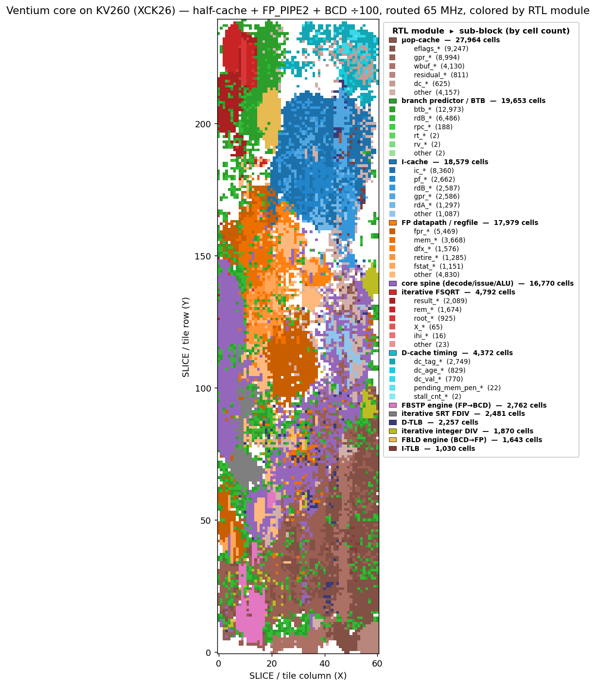
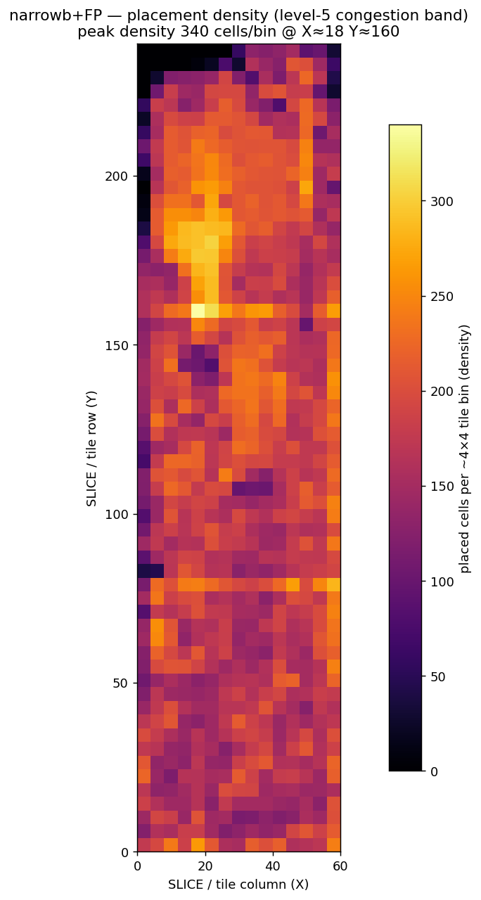
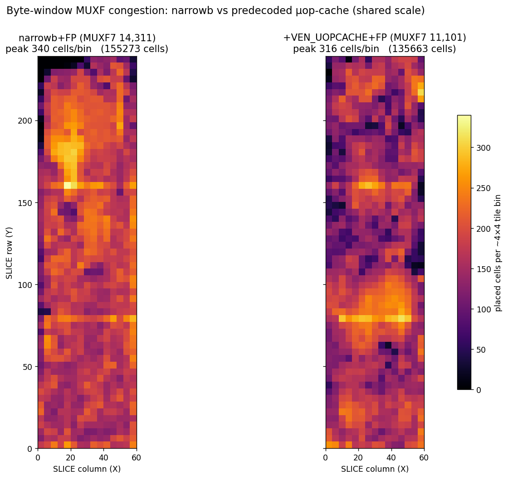
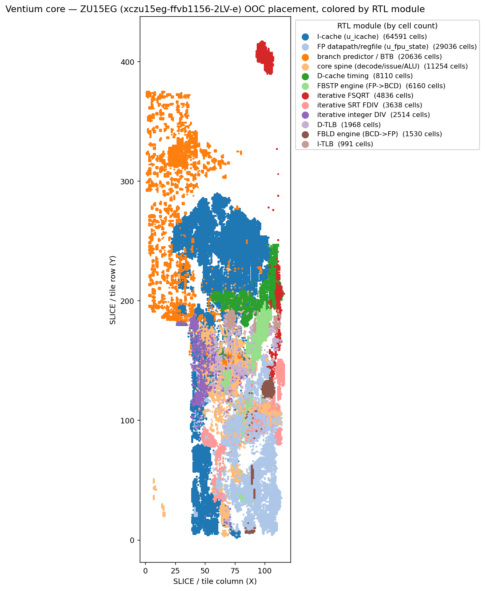

# Ventium

[][docs]

[docs]: https://al-255.github.io/ventium/

<p>
  
</p>

An RTL reconstruction of the original Intel **Pentium (P5 / P54C, non-MMX)**
microarchitecture, written in synthesizable SystemVerilog, simulated with
**Verilator**, and verified differentially against **QEMU**. It is **ISA-exact
and cycle-approximate for the broad subset it verifies** — high fidelity as an
architectural + cycle model, medium fidelity as a full microarchitectural / pin-
level clone (see [`docs/isa-coverage.md`](docs/isa-coverage.md)
/ [`docs/modeled-by-effect.md`](docs/modeled-by-effect.md)).

- **Sphinx Documentation:** <https://al-255.github.io/ventium/>
- **Reference Material + Benchmark Programs: (Private)** [`ventium-refs/`](ventium-refs/) submodule
  (Intel manuals, Alpert & Avnon, Agner Fog, datasheet, spec updates, and a
  working QEMU `-cpu pentium` functional + cycle golden harness). This submodule contains proprietary material, so it is not public; the reference material is cited in the design docs and the code comments, and the QEMU harness is described in `verif/qemu-trace/`.

## What's implemented

- **Integer core:** a 5-stage in-order **dual-issue (U/V)** pipeline (PF/D1/D2/EX/WB). With correct pairing rules.
- **Pipelined x87 FPU:** Implemented using ROM constants discovered by Ken Shirriff's reverse engineering. The SRT divider is able to faithfully reproduce the P5's infamous FDIV bug.
- **x87 transcendentals** (`F2XM1 FYL2X FPTAN FPATAN FYL2XP1 FSINCOS FSIN FCOS`, behind `+VEN_TRANSCENDENTAL`): iterative microcoded engines. F2XM1/FPATAN/FYL2X/FYL2XP1 are **bit-exact vs qemu-i386** (verbatim softfloat transcription); FSIN/FCOS/FSINCOS/FPTAN are **bit-exact vs a shared-polynomial silicon model** (~1.8 ulp vs quad — more faithful than qemu, which computes them at double precision). See `docs/m11-transcendental-spec.md`.
- **Memory:** 8 KiB / 2-way / 32 B split L1 I/D caches (LRU), split 16-entry I/D
  TLBs, and the 2-level paging MMU (A/D bits, 4 KiB + 4 MiB pages).
- **System mode:**  cold reset → real mode → protected-mode segmentation →
  paging → IDT-delivered interrupts/exceptions + `IRET`, TSS + cross-privilege +
  the **hardware task switch**, **SMM / `RSM`**, **debug registers + `#DB`**, and
  **virtual-8086** mode.
- **Errata:** documented P5 silicon errata (FDIV, FIST, F00F, MOV-moffs, the V86
  `POPF`/`IRET` `#DB`) reproduced behind a default-off flag, self-checked against
  the Intel Specification Updates (never against QEMU, which computes correctly).
- **Macro-workload lock-step (M7)** -- real programs run on the RTL in lock-step
  vs QEMU: **Quake** is bit-exact over **~1.1M instructions**, and a **Windows 95
  boot** is bit-exact to **213,859 instructions** (input-replay: QEMU is the golden
  + environment, the RTL is the checked CPU). This found + fixed **6 real ISA gaps**
  (`TEST r/m,imm` mem-form, `call gs:[]`, `LOCK CMPXCHG`, `IN`/`OUT`, `CPUID`, `INS`).
- **FPGA full-SoC implementation:** WIP - Targeting KV260 (Xilinx ZU5EV equivalent). The L1$ and peripherals are partially implemented in the PS to save FPGA resources, but the core + FPU are fully RTL.
- **PipeViz Visualizer:** A Custom PyQt5-based trace visualizer.

## Layout

```
rtl/                synthesizable SystemVerilog
  core/               the pipeline spine (core.sv) + ALU/decode packages,
                      the variable-length decoder, U/V issue, bpred_btb
  fpu/                x87 FPU — the 80-bit datapath package (+ state file)
  mem/                dcache_timing / icache / tlb
  bus/                biu_p5 pin-level 64-bit bus + the gated bus subsystem
  soc/                PC peripheral device models (PIC/PIT/RTC/i8042/port92/
                      acpipm/vga) — the M8 self-contained-SoC track
  ventium_top.sv      the verification top (core + leaf modules)
verif/
  qemu-trace/         gen_trace.py — golden architectural-state trace via the
                      QEMU gdbstub (-g); --system + the syscall/replay proxies
  tb/                 Verilator C++ testbench + bus-functional memory + DPI retire
  diff/               compare.py / compare_stream.py (O(1) memory) + tracefmt.py
  bench/              standard-benchmark differential harness (deep lock-step +
                      free-run syscall-emulation; coremark/whetstone/.../Quake)
  sys/                bare-metal system-mode tests + qemu-system goldens
  m7/                 Quake + Win95 lock-step harnesses
  soc/                device-module unit self-checks
  bus/                biu_p5 standalone self-consistency + 19 SVA gate
  errata/             errata self-checks (make m6)
docs/               trace-format.md (the producer/consumer contract), the
                    m*-spec.md design docs, and sphinx/ (the live catalog)
3rd-party/          opl3_fpga submodule (OPL3 FM synth, for a SoundBlaster card)
```

## Build & verify

```bash
git submodule update --init --recursive    # ventium-refs + 3rd-party/opl3_fpga

make verify          # fast differential gate (~2 s warm): user-mode functional
                     # + the M4/M5 cycle bands, parallelised + golden-cached
make verify-sys      # system-mode gates (pseg/pmode/ppage/pintr/pfault/pcpl/
                     # ptask/pdebug/pv86 + psmm structural)
make m1 m2 m3 m4 m5 m6    # per-milestone gates (m3 = x87, m6 = errata behind a flag)

# macro-workload lock-step (oracle-bound prefixes; see docs/m7-lockstep-spec.md):
bash verif/m7/run-quake-lockstep.sh 1000000     # Quake, 1M-instruction prefix
bash verif/m7/win95/run-win95-cosim.sh          # Win95 boot prefix

cd rtl && verilator --lint-only -sv -Wall -Wno-UNUSED -f ventium.f   # lint
```

The instruction catalog at <https://al-255.github.io/ventium/> is built from
`docs/sphinx/` and deployed by `.github/workflows/docs.yml` on every push.

## Standard benchmarks

The classic CPU benchmark suite — **coremark, whetstone, stream, dhrystone,
linpack**, and a kernel set (**sieve, matmul-int, matmul-fp, crc32, nqueens**),
all prebuilt as static linux-user i386 ELFs in `ventium-refs/` — runs on the RTL
two ways, both graded against QEMU `-cpu pentium`:

- **Per-instruction lock-step** (the rigorous net, `verif/bench/run-deep-sweep.sh`):
  every retired instruction's full architectural + x87 state is compared vs the
  QEMU gdbstub golden, deep (tens of millions of instructions per config) and
  parallel, with zstd-compressed goldens streamed through `compare_stream.py`
  (O(1) disk + memory). **18/18 configs are bit-exact (EQUIVALENT).**
- **Free-run to completion** (`--emulate-syscalls`, `verif/bench/run-freerun.sh`):
  the testbench emulates `int 0x80` directly, so the RTL runs a whole program at
  full Verilator speed, graded by its output vs QEMU-native. **coremark** runs its
  full **1.45-billion-instruction** workload and prints *"Correct operation
  validated"* with the canonical CRCs.

Realistic **P5 (U+V dual-issue) IPC** per workload, from the same cycle model the
`make verify` bands hold the RTL to (P5 ceiling = 2.0):

| workload  | IPC  |   | workload   | IPC  |
|-----------|------|---|------------|------|
| nqueens   | 1.23 |   | linpack    | 0.69 |
| sieve     | 1.22 |   | matmul-fp  | 0.63 |
| crc32     | 0.98 |   | stream     | 0.50 |
| dhrystone | 0.87 |   | matmul-int | 0.46 |
| coremark  | 0.81 |   | whetstone  | 0.43 |

Integer-loop kernels approach IPC ~1.2; x87/transcendental and memory-bound code
sit lower (multi-cycle `imul`/`FSIN`, U-pipe-only FP, branch mispredicts).

**Quake** (the TyrQuake P5 build) also free-runs on the RTL: it boots fully (pak
load, palette, renderer) and renders its console frame via the software rasteriser.
At the FPGA target of **66 MHz** the cycle model estimates **~15 FPS** at 320×200
(cycles-per-frame), in line with a real Pentium-66. Getting all this clean cost
**three fixes**: a CET `endbr32` / multi-byte-NOP decode gap (a real RTL miss,
regression-tested by `t_endbr`) and two QEMU-golden producer-fidelity bugs
(`clock_gettime64` capture width, the i386 `recvfrom` syscall number).

## FPGA synthesis (KV260)

The core + FPU are fully synthesizable. Below is the **real Vivado placement** of
the `core` (out-of-context) on the KV260's **XCK26** (Zynq UltraScale+ ZU5EV,
`xck26-sfvc784-2LV-c`), every placed leaf cell colored by its RTL module — the
physical clusters (I-cache + the folded byte-window decode spine, FP datapath,
branch predictor, the iterative FP engines, the core spine, …):



The byte-window decode muxes (`u_icache`, the `-flatten_hierarchy rebuilt` instance
that absorbs the spine's 12×32:1 alignment fabric) are the **level-5 routing-congestion
hotspot** — the bright band in the placement-density map (peak ≈ 340 cells / 4×4-tile bin):



**Best numbers** — OOC `core`, `+VTM_NO_DPI`, 15 ns target. Two configs: the
**verified production** config (narrowb, **bit-exact vs QEMU 75/75 + cycle bands**)
and the **experimental predecoded µop-cache** (`+VEN_UOPCACHE`, synth/APR-valid;
not yet verify-hardened) which deletes the byte-window decoder for a slot read:

| Resource | narrowb (production) | `+VEN_UOPCACHE` | Available |
|---|---:|---:|---:|
| **CLB LUTs (synth)** | 93,883 (80.2 %) | **79,442 (67.8 %)** | 117,120 |
| MUXF7 / MUXF8 | 14,311 / 6,216 | **11,101 / 4,181** | 58,560 / 29,280 |
| CARRY8 | 2,119 | 1,861 | 14,640 |
| DSP48E2 | 31 | 31 | 1,248 |
| Block RAM | 0 | 40 | 144 |
| **Fmax — logic only** | ~147 MHz (6.8 ns FP cone) | ~145 MHz | — |
| **Fmax — placed** (WNS@15 ns) | 46.0 MHz | 52.4 MHz | — |
| **Full route @ 15 ns** | ✗ does **not** route (42,392 overlaps) | ✅ **0 failed nets** | — |
| **Fmax — routed** (real OOC) | — (congestion wall) | **51.7 MHz** | — |



**The headline APR result:** at a 15 ns target the **predecoded µop-cache routes cleanly to a
real 51.7 MHz** (0 failed nets, routed WNS −4.35 ns) — while the production byte-window config
**cannot route at all** (the router gives up with 42,392 congestion overlaps). The µop-cache is
the **first config to route the design legally at a tight clock**, vs the prior ~35–42 MHz
*estimate*. Caveat: `+VEN_UOPCACHE` is an Fmax/APR demonstrator — it is **synth/route-valid and
its FP/area changes are bit-exact, but the slot-read front-end is not yet functionally
verify-hardened** (the `uop_ready` stall + branch-into-middle re-predecode are unbuilt); the
**narrowb config is the verified-bit-exact 75/75 production build**.

- **Area — the FP datapath shrink ([`TIMING_PROBLEMS.md`](fpga/TIMING_PROBLEMS.md) P0-13):
  −9,635 LUT (−10.7 %), bit-exact.** `fx_to_int_ex` (the FP→int conversion under FIST +
  FBSTP) carried a 128-bit barrel shifter where only 64 bits are ever non-zero — narrowing
  it bit-exactly (verified `make verify` 75/75) halved it across all five FIST/FBSTP
  instances (−8,636), plus a shared-round `f_eval` split (−999). The mantissa multiply was
  already in DSP (16 of 31 DSP48s), so it was never the LUT cost. Earlier wins: iterative
  FDIV/FSQRT/integer-DIV/FBSTP/FBLD engines + LUTRAM/BRAM caches brought the as-is 518 %
  single-cycle datapath under the device.
- **The predecoded µop-cache (P0-11) is the first lever to *reduce* the byte-window MUXF**
  (−22 % F7 / −33 % F8) instead of relocating it — by running the decoder on the multi-cycle
  fill walk and reading fixed-width µops by slot (the textbook P6/Sandy-Bridge fix; the user's
  "predecode prefixes 1 byte/cycle, pipeline the SIB length" insight). The *placer's* congestion
  level still reads level-5 (its density estimate is diffuse across the coupled front-end —
  BTB 23 %, icache 18 %, slow-path decoder 13 %, …), but that metric is misleading: the **actual
  router converges (0 overlaps) for the µop-cache and not for narrowb (42,392)** — the lower MUXF
  gives the router the channels it lacked. The route is the judge ([P0-14](fpga/TIMING_PROBLEMS.md)).
- **Fmax: the design is routing-congestion-bound, not logic-bound.** The worst path is the FP
  deferred-commit cone `fpp_reg → fpr` at ~6.8 ns *logic* (≈147 MHz) but **65 % routing** — the
  byte-window/front-end MUXF cluster has no spare channels. Placed: **46.0 MHz (narrowb) /
  52.4 MHz (µop-cache)**. A full Vivado strategy sweep (P0-9: `-muxf_remap`, AltSpreadLogic,
  AlternateRoutability, the congestion strategies) closes **none** of it — an architectural
  property of the single-cycle x86 byte-window decode, not a tooling choice.
- **The honest path to 66 MHz** (P0-12): the OOC placer has no PS8 anchor / floorplan, so it
  smears the whole `eip`-coupled front-end into one clock region. The cure for *diffuse-coupled*
  congestion is **in-context place + floorplan** (spread the cluster across regions near the
  PS8) — the real-chip number we must measure to ship — or a lower-utilization / higher-grade
  device. A **2-stage FP execute pipeline** (`+VEN_FP_PIPE`) and a **BTB-update pipeline**
  (`+VEN_BTB_PIPE`) keep FP + branch-predict off the critical path with **both FP and
  branch-mispredict cycle bands bit-identical**.

### On a larger device (ZU15EG): the verified production config routes

The **same verified `narrowb` production RTL**, OOC on a **Zynq UltraScale+ ZU15EG**
(`xczu15eg-ffvb1156-2LV-e`, same `-2LV` speed grade as the KV260, but ~3× the fabric:
341,280 LUTs), placed by module:



**The headline:** at the *same* 15 ns target, the production `narrowb` config — which is
**bit-exact-verified but cannot route on the KV260** (42,392 congestion overlaps, router
gives up) — **routes cleanly on the ZU15EG** (router converges: **0 overlaps, 0 unrouted
nets**). The 3× routing fabric gives the byte-window front-end the escape channels it lacks
on the small part. This is the first clean route of the *verified* build at a tight clock.

| Resource | KV260 `narrowb` (XCK26 / ZU5EV) | **ZU15EG `narrowb`** (`xczu15eg-…-2LV`) |
|---|---:|---:|
| CLB LUTs | 93,883 (**80.2 %** of 117,120) | 93,961 (**27.5 %** of 341,280) |
| CLB Registers | 28,675 | 29,394 (4.3 %) |
| MUXF7 / MUXF8 | 14,311 / 6,216 | 14,312 / 6,216 |
| CARRY8 / DSP48E2 / BRAM | 2,119 / 31 / 0 | 2,119 / 31 / 0 |
| Placer congestion | level 6 (wall) | level 5 (local, `u_icache` byte-window) |
| **Full route @ 15 ns** | ✗ **does not route** (42,392 overlaps) | ✅ **routes — 0 overlaps / 0 unrouted** |
| Fmax — placed (WNS@15 ns) | 46.0 MHz | 51.1 MHz (WNS −4.56 ns) |
| **Fmax — routed (real OOC)** | — (never routed) | **40.6 MHz** (WNS −9.60 ns) |

The routed **40.6 MHz** is the honest critical-path number — lower than the placer's 51 MHz
*estimate* because actually wiring the congested byte-window region costs real routing delay,
and lower than the ~148 MHz logic-only ceiling (the FP cone is **6.74 ns**). The placer still
flags **level-5 congestion local to `u_icache`** even on the big device — confirming the wall
is the **single-cycle x86 byte-window decode itself**, an architectural property, not a device
or tooling limit. The bigger part buys *routability* (and a clean, shippable bitstream path),
not a dramatically higher clock; closing toward 66 MHz still needs the µop-cache front-end
([P0-11](fpga/TIMING_PROBLEMS.md)) and in-context floorplanning ([P0-12](fpga/TIMING_PROBLEMS.md)).

Reproduce — KV260: `CONFIG=narrowb MODE=full vivado -mode batch -source fpga/scripts/apr_run.tcl`;
ZU15EG: prepend `PART=xczu15eg-ffvb1156-2LV-e OUTTAG=_zu15eg`. Then
`python3 fpga/scripts/render_device_view.py …` / `render_congestion.py` / `render_compare.py`.
Full timing backlog + methodology in [`fpga/TIMING_PROBLEMS.md`](fpga/TIMING_PROBLEMS.md).

## Status

The planned roadmap is **complete** — M0–M6, the M2S.0–.6 system-mode track + the
M2S.4b hardware task switch, M5B + its M5B-int integration, the M6B system errata,
and the R1/R2 RTL refactors. **M7** (macro-workload lock-step — Quake + Win95)
landed, and **M8** (the self-contained SoC) is in progress. See
[`PROGRESS.md`](PROGRESS.md) and [`PROGRESS_Jun04.md`](PROGRESS_Jun04.md) for the
full, dated detail.
