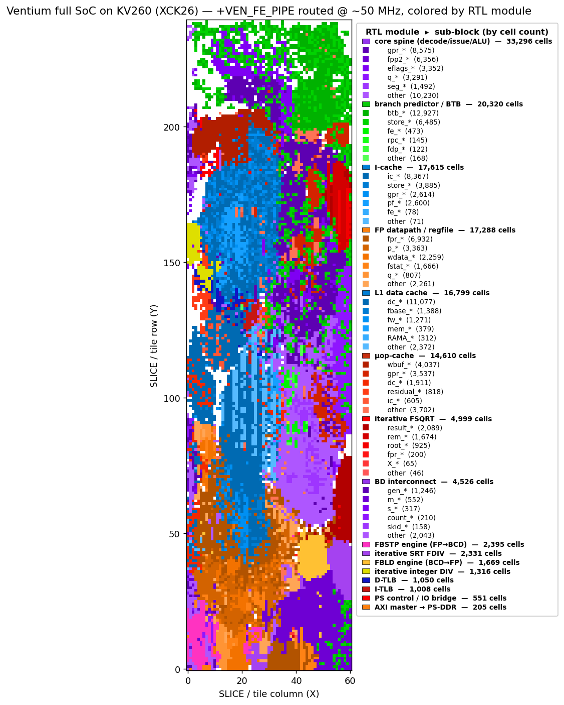

# Ventium

[][docs]

[docs]: https://al-255.github.io/ventium/

<p>
  
</p>

An RTL reconstruction of the original Intel **Pentium (P5 / P54C, non-MMX)**
microarchitecture, written in synthesizable SystemVerilog, simulated with
**Verilator**, and verified differentially against **QEMU**. It is **ISA-exact
and cycle-approximate for the broad subset it verifies** — high fidelity as an
architectural + cycle model, medium fidelity as a full microarchitectural / pin-
level clone (see [`docs/isa-coverage.md`](docs/isa-coverage.md)
/ [`docs/modeled-by-effect.md`](docs/modeled-by-effect.md)).

- **Sphinx Documentation:** <https://al-255.github.io/ventium/>
- **Reference Material + Benchmark Programs: (Private)** [`ventium-refs/`](ventium-refs/) submodule
  (Intel manuals, Alpert & Avnon, Agner Fog, datasheet, spec updates, and a
  working QEMU `-cpu pentium` functional + cycle golden harness). This submodule contains proprietary material, so it is not public; the reference material is cited in the design docs and the code comments, and the QEMU harness is described in `verif/qemu-trace/`.

## What's implemented

- **Integer core:** a 5-stage in-order **dual-issue (U/V)** pipeline (PF/D1/D2/EX/WB). With correct pairing rules.
- **Pipelined x87 FPU:** Implemented using ROM constants discovered by Ken Shirriff's reverse engineering. The SRT divider is able to faithfully reproduce the P5's infamous FDIV bug.
- **x87 transcendentals** (`F2XM1 FYL2X FPTAN FPATAN FYL2XP1 FSINCOS FSIN FCOS`, behind `+VEN_TRANSCENDENTAL`): iterative microcoded engines. F2XM1/FPATAN/FYL2X/FYL2XP1 are **bit-exact vs qemu-i386** (verbatim softfloat transcription); FSIN/FCOS/FSINCOS/FPTAN are **bit-exact vs a shared-polynomial silicon model** (~1.8 ulp vs quad — more faithful than qemu, which computes them at double precision). See `docs/m11-transcendental-spec.md`.
- **Memory:** 8 KiB / 2-way / 32 B split L1 I/D caches (LRU), split 16-entry I/D
  TLBs, and the 2-level paging MMU (A/D bits, 4 KiB + 4 MiB pages).
- **System mode:**  cold reset → real mode → protected-mode segmentation →
  paging → IDT-delivered interrupts/exceptions + `IRET`, TSS + cross-privilege +
  the **hardware task switch**, **SMM / `RSM`**, **debug registers + `#DB`**, and
  **virtual-8086** mode.
- **Errata:** documented P5 silicon errata (FDIV, FIST, F00F, MOV-moffs, the V86
  `POPF`/`IRET` `#DB`) reproduced behind a default-off flag, self-checked against
  the Intel Specification Updates (never against QEMU, which computes correctly).
- **Macro-workload lock-step (M7)** -- real programs run on the RTL in lock-step
  vs QEMU: **Quake** is bit-exact over **~1.1M instructions**, and a **Windows 95
  boot** is bit-exact to **213,859 instructions** (input-replay: QEMU is the golden
  + environment, the RTL is the checked CPU). This found + fixed **6 real ISA gaps**
  (`TEST r/m,imm` mem-form, `call gs:[]`, `LOCK CMPXCHG`, `IN`/`OUT`, `CPUID`, `INS`).
- **FPGA full-SoC implementation:** WIP - Targeting KV260 (Xilinx ZU5EV equivalent). The L1$ and peripherals are partially implemented in the PS to save FPGA resources, but the core + FPU are fully RTL.
- **PipeViz Visualizer:** A Custom PyQt5-based trace visualizer.

## Layout

```
rtl/                synthesizable SystemVerilog
  core/               the pipeline spine (core.sv) + ALU/decode packages,
                      the variable-length decoder, U/V issue, bpred_btb
  fpu/                x87 FPU — the 80-bit datapath package (+ state file)
  mem/                dcache_timing / icache / tlb
  bus/                biu_p5 pin-level 64-bit bus + the gated bus subsystem
  soc/                PC peripheral device models (PIC/PIT/RTC/i8042/port92/
                      acpipm/vga) — the M8 self-contained-SoC track
  ventium_top.sv      the verification top (core + leaf modules)
verif/
  qemu-trace/         gen_trace.py — golden architectural-state trace via the
                      QEMU gdbstub (-g); --system + the syscall/replay proxies
  tb/                 Verilator C++ testbench + bus-functional memory + DPI retire
  diff/               compare.py / compare_stream.py (O(1) memory) + tracefmt.py
  bench/              standard-benchmark differential harness (deep lock-step +
                      free-run syscall-emulation; coremark/whetstone/.../Quake)
  sys/                bare-metal system-mode tests + qemu-system goldens
  m7/                 Quake + Win95 lock-step harnesses
  soc/                device-module unit self-checks
  bus/                biu_p5 standalone self-consistency + 19 SVA gate
  errata/             errata self-checks (make m6)
docs/               trace-format.md (the producer/consumer contract), the
                    m*-spec.md design docs, and sphinx/ (the live catalog)
3rd-party/          opl3_fpga submodule (OPL3 FM synth, for a SoundBlaster card)
```

## Build & verify

```bash
git submodule update --init --recursive    # ventium-refs + 3rd-party/opl3_fpga

make verify          # fast differential gate (~2 s warm): user-mode functional
                     # + the M4/M5 cycle bands, parallelised + golden-cached
make verify-sys      # system-mode gates (pseg/pmode/ppage/pintr/pfault/pcpl/
                     # ptask/pdebug/pv86 + psmm structural)
make m1 m2 m3 m4 m5 m6    # per-milestone gates (m3 = x87, m6 = errata behind a flag)

# macro-workload lock-step (oracle-bound prefixes; see docs/m7-lockstep-spec.md):
bash verif/m7/run-quake-lockstep.sh 1000000     # Quake, 1M-instruction prefix
bash verif/m7/win95/run-win95-cosim.sh          # Win95 boot prefix

cd rtl && verilator --lint-only -sv -Wall -Wno-UNUSED -f ventium.f   # lint
```

The instruction catalog at <https://al-255.github.io/ventium/> is built from
`docs/sphinx/` and deployed by `.github/workflows/docs.yml` on every push.

## Standard benchmarks

The classic CPU benchmark suite — **coremark, whetstone, stream, dhrystone,
linpack**, and a kernel set (**sieve, matmul-int, matmul-fp, crc32, nqueens**),
all prebuilt as static linux-user i386 ELFs in `ventium-refs/` — runs on the RTL
two ways, both graded against QEMU `-cpu pentium`:

- **Per-instruction lock-step** (the rigorous net, `verif/bench/run-deep-sweep.sh`):
  every retired instruction's full architectural + x87 state is compared vs the
  QEMU gdbstub golden, deep (tens of millions of instructions per config) and
  parallel, with zstd-compressed goldens streamed through `compare_stream.py`
  (O(1) disk + memory). **18/18 configs are bit-exact (EQUIVALENT).**
- **Free-run to completion** (`--emulate-syscalls`, `verif/bench/run-freerun.sh`):
  the testbench emulates `int 0x80` directly, so the RTL runs a whole program at
  full Verilator speed, graded by its output vs QEMU-native. **coremark** runs its
  full **1.45-billion-instruction** workload and prints *"Correct operation
  validated"* with the canonical CRCs.

Realistic **P5 (U+V dual-issue) IPC** per workload, from the same cycle model the
`make verify` bands hold the RTL to (P5 ceiling = 2.0):

| workload  | IPC  |   | workload   | IPC  |
|-----------|------|---|------------|------|
| nqueens   | 1.23 |   | linpack    | 0.69 |
| sieve     | 1.22 |   | matmul-fp  | 0.63 |
| crc32     | 0.98 |   | stream     | 0.50 |
| dhrystone | 0.87 |   | matmul-int | 0.46 |
| coremark  | 0.81 |   | whetstone  | 0.43 |

Integer-loop kernels approach IPC ~1.2; x87/transcendental and memory-bound code
sit lower (multi-cycle `imul`/`FSIN`, U-pipe-only FP, branch mispredicts).

**Quake** (the TyrQuake P5 build) also free-runs on the RTL: it boots fully (pak
load, palette, renderer) and renders its console frame via the software rasteriser.
At the FPGA target of **66 MHz** the cycle model estimates **~15 FPS** at 320×200
(cycles-per-frame), in line with a real Pentium-66. Getting all this clean cost
**three fixes**: a CET `endbr32` / multi-byte-NOP decode gap (a real RTL miss,
regression-tested by `t_endbr`) and two QEMU-golden producer-fidelity bugs
(`clock_gettime64` capture width, the i386 `recvfrom` syscall number).

## FPGA synthesis (KV260)

The core + FPU are fully synthesizable and place-and-route cleanly out-of-context on
the KV260 (**XCK26**, Zynq UltraScale+ ZU5EV). The routed placement of the 65 MHz
half-cache build, every leaf cell colored by its RTL module (luminance = sub-block):


Headline OOC `core` results (`xck26-sfvc784-2LV-c`, `+VTM_NO_DPI`, 15 ns target):

| Config | LUTs | FF | BRAM | DSP | Synth Fmax | **Routed Fmax** | Worst path |
|---|---:|---:|---:|---:|---:|---:|---|
| `+VEN_UOPCACHE` (µop-cache, 8 KB L1s) | 79.4k (68%) | 25.6k | 40 | 31 | — | 51.7 MHz | FADD commit cone |
| `+VEN_CACHE_HALF` (4 KB L1s) | 78.0k (67%) | 25.6k | 40 | 31 | 59.4 | 52.6 MHz | FADD `fpp→fpr` cone |
| `+VEN_FP_PIPE2` (2-stage FADD commit) | 76.7k (65%) | 25.8k | 40 | 31 | 78.4 | 63.0 MHz | `u_bcd` (FBSTP) engine |
| **+ BCD ÷100 step** (`ven_bcd`, opt-in `+VEN_BCD_DIV100`) | 76.6k (65%) | 25.8k | 40 | 31 | 80.6 | **65.3 MHz** | µop-cache fill→front-end |

Three architectural walls, broken in turn. (1) The **single-cycle x86 byte-window
decoder** (`u_icache` MUXF cluster) — the µop-cache deletes it (predecode-on-fill, slot
reads), the first config to route legally. (2) The **latency-1 ~80-level FADD
deferred-commit cone** (`fpp → fx_round_pack → fpr`): `+VEN_FP_PIPE2` splits it across the
FP scoreboard's existing 3-cycle latency window (the result still publishes at issue+lat),
so it is **cycle-safe** — `make verify` GREEN, the M5 FP cycle bands held, default build
byte/cycle-identical (`make verify-fppipe2`). (3) The **FBSTP BCD engine** (`u_bcd`): one
÷100 per step instead of two chained ÷10 halves its cone — bit-exact + cycle-neutral
(`make verify-bcd`). That takes the K26 to **65.3 MHz** (`ExtraNetDelay_high`); the wall is
now the µop-cache fill→front-end cluster (route-bound — the diffuse-congestion case the
docs flag for in-context floorplanning).

**Full SoC, in-context → deployable bitstream.** The numbers above are out-of-context (the
`core` alone). The actual KV260 image wraps the core + FPU with the L1/AXI memory subsystem
(→ PS-DDR), the `ven_soc_axil` PS bridge, and the BD interconnect, placed against the PS8 and
routed to a **bitstream + `.xsa`**. In context the **`eip`/TLB fetch cone** binds: the SoC will
**not legally route** at 60 MHz (8766 node overlaps) until **`+VEN_FE_PIPE`** — a page-keyed
micro-TLB that registers the current page's translation so steady-state fetch stops re-walking the
TLB compare (1-cycle stall only on a page crossing; `ifdef`-gated, default build cycle-identical).
With it, the full SoC routes clean at **WNS −3.195 ns → ~50.4 MHz** (the translate cone leaves the
critical path; the new worst path is the same µop-cache fill→`eip` cluster, route-bound).



📄 **Full results, device views, congestion maps, the full-SoC `+VEN_FE_PIPE` image, the ZU15EG +
half-cache + FP_PIPE2 experiments, and methodology:** [`docs/fpga-synthesis.md`](docs/fpga-synthesis.md) ·
[`fpga/TIMING_PROBLEMS.md`](fpga/TIMING_PROBLEMS.md).

## Status

The planned roadmap is **complete** — M0–M6, the M2S.0–.6 system-mode track + the
M2S.4b hardware task switch, M5B + its M5B-int integration, the M6B system errata,
and the R1/R2 RTL refactors. **M7** (macro-workload lock-step — Quake + Win95)
landed, and **M8** (the self-contained SoC) is in progress. See
[`PROGRESS.md`](PROGRESS.md) and [`PROGRESS_Jun04.md`](PROGRESS_Jun04.md) for the
full, dated detail.
