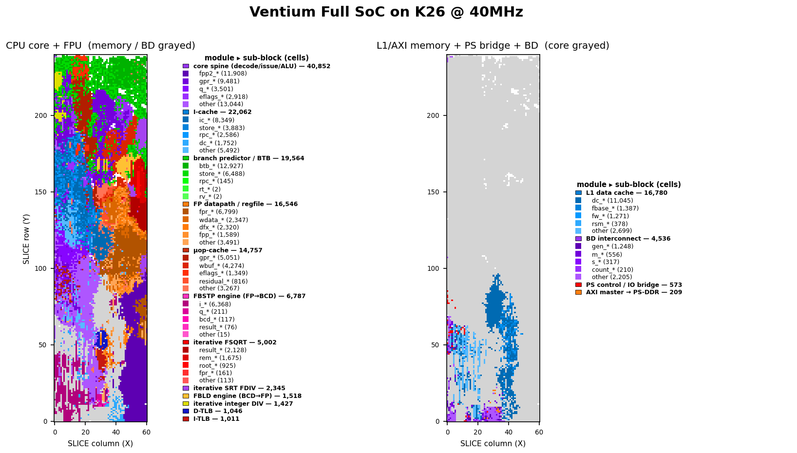

# Ventium

[][docs]

[docs]: https://al-255.github.io/ventium/

<p>
  
</p>

An RTL reconstruction of the original Intel **Pentium (P5 / P54C, non-MMX)**
microarchitecture, written in synthesizable SystemVerilog, simulated with
**Verilator**, and verified differentially against **QEMU**. It is **ISA-exact
and cycle-approximate for the broad subset it verifies** — high fidelity as an
architectural + cycle model, medium fidelity as a full microarchitectural / pin-
level clone (see [`docs/isa-coverage.md`](docs/isa-coverage.md)
/ [`docs/modeled-by-effect.md`](docs/modeled-by-effect.md)).

- **Sphinx Documentation:** <https://al-255.github.io/ventium/>
- **Reference Material + Benchmark Programs: (Private)** [`ventium-refs/`](ventium-refs/) submodule
  (Intel manuals, Alpert & Avnon, Agner Fog, datasheet, spec updates, and a
  working QEMU `-cpu pentium` functional + cycle golden harness). This submodule contains proprietary material, so it is not public; the reference material is cited in the design docs and the code comments, and the QEMU harness is described in `verif/qemu-trace/`.

## What's implemented

- **Integer core:** a 5-stage in-order **dual-issue (U/V)** pipeline (PF/D1/D2/EX/WB). With correct pairing rules.
- **Pipelined x87 FPU:** Implemented using ROM constants discovered by Ken Shirriff's reverse engineering. The SRT divider is able to faithfully reproduce the P5's infamous FDIV bug.
- **x87 transcendentals** (`F2XM1 FYL2X FPTAN FPATAN FYL2XP1 FSINCOS FSIN FCOS`, behind `+VEN_TRANSCENDENTAL`): iterative microcoded engines. F2XM1/FPATAN/FYL2X/FYL2XP1 are **bit-exact vs qemu-i386** (verbatim softfloat transcription); FSIN/FCOS/FSINCOS/FPTAN are **bit-exact vs a shared-polynomial silicon model** (~1.8 ulp vs quad — more faithful than qemu, which computes them at double precision). See `docs/m11-transcendental-spec.md`.
- **Memory:** 8 KiB / 2-way / 32 B split L1 I/D caches (LRU), split 16-entry I/D
  TLBs, and the 2-level paging MMU (A/D bits, 4 KiB + 4 MiB pages).
- **System mode:**  cold reset → real mode → protected-mode segmentation →
  paging → IDT-delivered interrupts/exceptions + `IRET`, TSS + cross-privilege +
  the **hardware task switch**, **SMM / `RSM`**, **debug registers + `#DB`**, and
  **virtual-8086** mode.
- **Errata:** documented P5 silicon errata (FDIV, FIST, F00F, MOV-moffs, the V86
  `POPF`/`IRET` `#DB`) reproduced behind a default-off flag, self-checked against
  the Intel Specification Updates (never against QEMU, which computes correctly).
- **Macro-workload lock-step (M7)** -- real programs run on the RTL in lock-step
  vs QEMU: **Quake** is bit-exact through **~1.83M instructions** (to a documented
  QEMU-environment boundary, not a CPU divergence — see below), and a **Windows 95
  boot** is bit-exact to **213,859 instructions** (input-replay: QEMU is the golden
  + environment, the RTL is the checked CPU). This found + fixed **6 real ISA gaps**
  (`TEST r/m,imm` mem-form, `call gs:[]`, `LOCK CMPXCHG`, `IN`/`OUT`, `CPUID`, `INS`).
- **A self-contained PC SoC (M8/M9/F-track):** PIC/PIT/RTC/i8042/port92/UART/VGA/
  IDE/DMA/FDC device models, pinned to `qemu-system-i386` by per-record differential
  gates (`verif/soc/run-all-soc-gates.sh`: **24 gates** = 23 SoC differentials + the
  external `test386` tester; plus a standalone SeaBIOS boot gate). The **unmodified
  QEMU SeaBIOS `bios.bin`** completes its full POST on the RTL and boots **FreeDOS to
  an interactive `C:\>` prompt** — in Verilator simulation (see below).
- **FPGA full SoC (KV260):** a routed, deployable **40 MHz** bitstream for the Kria
  KV260 (XCK26) — core + FPU + L1/AXI fully in the PL, the slow peripherals emulated
  by the PS A53 under Linux. **No board has been attached yet** — the image is
  structurally verified (timing/DRC/unit gates), not hardware-tested.
- **PipeViz Visualizer:** A Custom PyQt5-based trace visualizer.

## Layout

```
rtl/                synthesizable SystemVerilog
  core/               the pipeline spine (core.sv) + ALU/decode packages,
                      the variable-length decoder, U/V issue, bpred_btb
  fpu/                x87 FPU — the 80-bit datapath package (+ state file)
  mem/                dcache_timing / icache / tlb
  bus/                biu_p5 pin-level 64-bit bus + the gated bus subsystem
  soc/                PC peripheral device models (PIC/PIT/RTC/i8042/port92/
                      acpipm/vga) — the M8 self-contained-SoC track
  ventium_top.sv      the verification top (core + leaf modules)
verif/
  qemu-trace/         gen_trace.py — golden architectural-state trace via the
                      QEMU gdbstub (-g); --system + the syscall/replay proxies
  tb/                 Verilator C++ testbench + bus-functional memory + DPI retire
  diff/               compare.py / compare_stream.py (O(1) memory) + tracefmt.py
  bench/              standard-benchmark differential harness (deep lock-step +
                      free-run syscall-emulation; coremark/whetstone/.../Quake)
  sys/                bare-metal system-mode tests + qemu-system goldens
  m7/                 Quake + Win95 lock-step harnesses
  soc/                the SoC differential gates (run-all-soc-gates.sh) + unit checks
  bus/ errata/        biu_p5 standalone + 19 SVA gate; errata self-checks (make m6)
fpga/               KV260 build scripts (BD + impl → bit/.xsa), the microSD
                    boot-image pipeline (sd/), timing + architecture notes
sw/                 PS-side software — ven_soc_app + the HID/VNC daemons (ps/),
                    the PS-offload peripheral C models (ps_periph/)
docs/               trace-format.md (the producer/consumer contract), the
                    m*-spec.md design docs, and sphinx/ (the live catalog)
3rd-party/          opl3_fpga submodule (OPL3 FM synth, for a SoundBlaster card)
```

## Build & verify

```bash
git submodule update --init --recursive    # ventium-refs + 3rd-party/opl3_fpga

make verify          # fast differential gate (~2 s warm): user-mode functional
                     # + the M4/M5 cycle bands, parallelised + golden-cached
make verify-sys      # system-mode gates (pseg/pmode/ppage/pintr/pfault/pcpl/
                     # ptask/pdebug/pv86 + psmm structural)
make m1 m2 m3 m4 m5 m6    # per-milestone gates (m3 = x87, m6 = errata behind a flag)

bash verif/soc/run-all-soc-gates.sh   # the SoC battery: 24 gates (23 per-record
                                      # qemu-system differentials + test386)

bash verif/m7/run-quake-lockstep.sh 1000000     # macro lock-step (Quake prefix;
bash verif/m7/win95/run-win95-cosim.sh          #  + Win95 boot — see docs/m7-*)

cd rtl && verilator --lint-only -sv -Wall -Wno-UNUSED -f ventium.f   # lint
```

The instruction catalog at <https://al-255.github.io/ventium/> is built from
`docs/sphinx/` and deployed by `.github/workflows/docs.yml` on every push.

## Standard benchmarks

The classic CPU benchmark suite — **coremark, whetstone, stream, dhrystone,
linpack**, and a kernel set (**sieve, matmul-int, matmul-fp, crc32, nqueens**),
all prebuilt as static linux-user i386 ELFs in `ventium-refs/` — runs on the RTL
two ways, both graded against QEMU `-cpu pentium`:

- **Per-instruction lock-step** (the rigorous net, `verif/bench/run-deep-sweep.sh`):
  every retired instruction's full architectural + x87 state is compared vs the
  QEMU gdbstub golden, deep (tens of millions of instructions per config) and
  parallel, with zstd-compressed goldens streamed through `compare_stream.py`
  (O(1) disk + memory). **18 of the 19 configs are bit-exact (EQUIVALENT)**; the
  19th, a 30M-instruction Quake prefix, is bit-exact through **1.83M instructions**,
  up to a documented environmental boundary (musl's netlink interface enumeration
  branches on the host QEMU PID — producer nondeterminism, not a CPU divergence).
- **Free-run to completion** (`--emulate-syscalls`, `verif/bench/run-freerun.sh`):
  the testbench emulates `int 0x80` directly, so the RTL runs a whole program at
  full Verilator speed, graded by its output vs QEMU-native. **coremark** runs its
  full **1.45-billion-instruction** workload and prints *"Correct operation
  validated"* with the canonical CRCs.

Realistic **P5 (U+V dual-issue) IPC** per workload, from the same cycle model the
`make verify` bands hold the RTL to (P5 ceiling = 2.0):

| workload  | IPC  |   | workload   | IPC  |
|-----------|------|---|------------|------|
| nqueens   | 1.23 |   | linpack    | 0.69 |
| sieve     | 1.22 |   | matmul-fp  | 0.63 |
| crc32     | 0.98 |   | stream     | 0.50 |
| dhrystone | 0.87 |   | matmul-int | 0.46 |
| coremark  | 0.81 |   | whetstone  | 0.43 |

Integer-loop kernels approach IPC ~1.2; x87/transcendental and memory-bound code
sit lower (multi-cycle `imul`/`FSIN`, U-pipe-only FP, branch mispredicts).

**Quake** (the TyrQuake P5 build) also free-runs on the RTL: it boots fully (pak
load, palette, renderer) and renders its console frame via the software rasteriser.
From cycles-per-frame the cycle model estimates **~15 FPS** at 320×200 at 66 MHz
(in line with a real Pentium-66) — **~9 FPS** at the KV260 image's 40 MHz; both are
cycle-model estimates, not hardware measurements. Getting all this clean cost
**three fixes**: a CET `endbr32` / multi-byte-NOP decode gap (a real RTL miss,
regression-tested by `t_endbr`) and two QEMU-golden producer-fidelity bugs
(`clock_gettime64` capture width, the i386 `recvfrom` syscall number).

## Booting the real PC stack: SeaBIOS → FreeDOS (RTL, Verilator simulation)

The F3 milestone: the **unmodified QEMU SeaBIOS** `bios.bin` (rel-1.16.3) runs its
entire power-on self-test on the RTL (real → 32-bit protected mode → back, ~5.55M
instructions), chain-loads via `INT 13h` from the `ven_ide` disk model, and boots
**FreeDOS** (kernel ke2045, FreeCom 0.86) to an **interactive prompt**. Keystrokes
(set-1 scancodes injected into the i8042 model by the testbench) traverse the full PC
input path — i8042 → IRQ1 → 8259 PIC → `INT 9` → BIOS keyboard buffer → FreeCom — and
the typed commands run through `INT 21h` → FAT16 → IDE, with output drawn by SeaVGABIOS
`INT 10h` into text VRAM at `0xB8000`. The actual screen, dumped from VRAM at
**195,000,000 retired instructions / 1,511,243,707 clocks**:

```
VGA BIOS initialized.
C:\>ver

FreeCom version 0.86 - WATCOMC - XMS_Swap [Dec 30 2024 22:10:51]
C:\>dir
 Volume in drive C is FREEDOS
 Volume Serial Number is 1C6C-E236
 Directory of C:\

KERNEL   SYS        48,856  06-11-26 10:55p
COMMAND  COM        87,772  06-11-26 10:55p
AUTOEXEC BAT             9  06-12-26 12:24p
VGAINIT  COM           113  06-12-26  3:32p
VGABIOS  BIN        38,912  06-12-26 12:24p
         5 file(s)        175,662 bytes
         0 dir(s)       2,845,696 bytes free
C:\>
```

This is **simulation, not hardware** — and it earned its keep: the boot stalled at
6.844M instructions on a corrupted kernel, root-caused to the 32-bit ModRM EA decode
missing the SDM's **SS-segment defaults** for `ESP`/`EBP`-based addressing — SeaBIOS's
IRQ trampoline `mov ds,[esp+8]` read `DS:` garbage and saved an interrupt frame over
the freshly loaded `kernel.sys`. QEMU never expresses it (its PIT takes ~zero IRQs in
that window), and the fix is invisible to every flat-segment gate — the whole battery
(77/77 + the 24 SoC gates) stayed green throughout.

**F4 (DOS Quake) is in progress — no RTL-Quake claim is made.** A Quake 1.06 shareware
disk image (official `quake106.zip`: `QUAKE.EXE` + CWSDPMI + `PAK0.PAK` on FreeDOS/FAT16)
boots fully unattended **under qemu-system** to the in-game `demo1` timedemo — that
validates the disk/asset/DPMI chain, *not the RTL*. The RTL run of the same image is
underway and still mid-boot, with no rendered frame yet.

## FPGA synthesis (KV260)

The core + FPU are fully synthesizable and place-and-route cleanly out-of-context on
the KV260 (**XCK26**, Zynq UltraScale+ ZU5EV). Headline OOC `core` results (`xck26-sfvc784-2LV-c`, `+VTM_NO_DPI`, 15 ns target):

| Config | LUTs | FF | BRAM | DSP | Synth Fmax | **Routed Fmax** | Worst path |
|---|---:|---:|---:|---:|---:|---:|---|
| `+VEN_UOPCACHE` (µop-cache, 8 KB L1s) | 79.4k (68%) | 25.6k | 40 | 31 | — | 51.7 MHz | FADD commit cone |
| `+VEN_CACHE_HALF` (4 KB L1s) | 78.0k (67%) | 25.6k | 40 | 31 | 59.4 | 52.6 MHz | FADD `fpp→fpr` cone |
| `+VEN_FP_PIPE2` (2-stage FADD commit) | 76.7k (65%) | 25.8k | 40 | 31 | 78.4 | 63.0 MHz | `u_bcd` (FBSTP) engine |
| **+ BCD ÷100 step** (`ven_bcd`, opt-in `+VEN_BCD_DIV100`) | 76.6k (65%) | 25.8k | 40 | 31 | 80.6 | **65.3 MHz** | µop-cache fill→front-end |

Three architectural walls, broken in turn: the **single-cycle x86 byte-window decoder**
(deleted by the µop-cache — predecode-on-fill, the first config to route legally); the
**latency-1 ~80-level FADD deferred-commit cone** (split **cycle-safely** across the FP
scoreboard's existing 3-cycle latency window by `+VEN_FP_PIPE2` — `make verify` GREEN, M5
FP bands held, default build byte/cycle-identical); and the **FBSTP BCD engine** (one ÷100
per step instead of two chained ÷10 — bit-exact + cycle-neutral). That takes the K26 core
to **65.3 MHz**; the remaining wall is route-bound µop-cache fill→front-end congestion.

**Full SoC, in-context → deployable bitstream.** The numbers above are out-of-context.
The actual KV260 image adds the L1/AXI memory subsystem (→ PS-DDR), the `ven_soc_axil`
PS bridge, and the BD interconnect, routed to a **bitstream + `.xsa`**. In context the
`eip`/TLB fetch cone binds: the SoC does not legally route at 60 MHz until
**`+VEN_FE_PIPE`** — a page-keyed micro-TLB (1-cycle stall only on a page crossing;
`ifdef`-gated, default build cycle-identical) — after which it routes clean at **~50.4 MHz**.

**Deployable clock = 40 MHz.** A 60 MHz full-SoC close is *not feasible on the XCK26* (the
OOC ceiling is 65.3 MHz; the SoC's extra fabric leaves diffuse fill→`eip` congestion no
floorplan clears). The FE_PIPE build closed 50 MHz until the F3 ISA-completeness work
(16-bit ModRM EAs, FF-group far forms, interruptible `HLT`, real-mode IVT delivery) cost
~3.5 ns on the high-fanout µop-cache fill net (WNS −3.225 ns, ~43 MHz achievable). The
shipped image targets **`pl_clk0` = 40 MHz**, routed at **WNS +0.104 ns** (timing met); the
PS owns the PL clock, and `venclk.sh` can step it 40 → 50 MHz on silicon with a firmware
smoke test per step. A larger part (e.g. the ZU15EG) would clear 60+.

The routed 40 MHz image, split into its two halves — the CPU core + FPU (left, memory/BD
grayed) and the L1/AXI memory + PS bridge + BD interconnect (right, core grayed), every leaf
cell colored by RTL module with per-panel legends:



📄 **Full results, the all-modules device view, congestion maps, the ZU15EG + half-cache +
FP_PIPE2 experiments, and methodology:** [`docs/fpga-synthesis.md`](docs/fpga-synthesis.md) ·
[`fpga/TIMING_PROBLEMS.md`](fpga/TIMING_PROBLEMS.md).

## The KV260 board image

The current deployable build (`fpga/build/kv260_soc_impl_linux_40/`, config = µop-cache +
half-cache + FP_PIPE2 + FE_PIPE) is routed to a bitstream + `.xsa`, post-route:

| Resource (XCK26) | Used | Available | Util |
|---|---:|---:|---:|
| CLB LUTs | 94,712 | 117,120 | 80.9 % |
| CLB registers | 31,208 | 234,240 | 13.3 % |
| Block RAM tiles | 40 | 144 | 27.8 % |
| DSPs | 31 | 1,248 | 2.5 % |

Timing at `pl_clk0` = **40 MHz** (25.000 ns): setup **WNS +0.104 ns**, hold WHS +0.008 ns,
**0 failing endpoints** of 112,136; DRC carries advisory warnings only (DSP-pipelining
suggestions). The design occupies 98.3 % of the CLBs — the diffuse-congestion regime
described above. Reports (`timing_impl.rpt`/`util_impl.rpt`/`drc_impl.rpt`) are on disk.

**Architecture: the PS as the I/O processor.** Only the latency-critical elements live
in the PL: core + FPU, L1 + AXI master into the PS DDR (carveout at `REMAP_BASE =
0x4000_0000`), and the `ven_soc_axil` control slave. The slow PC peripherals run as
**C models on the A53 under Linux** — the same C models the `ps-cosims` gate holds to
*C model == RTL == qemu*. `ven_soc_app --dos` routes the PIC, i8042 and VGA-register
ports to the PS and injects interrupts through the `R_INTR` seam (the PS stages
{vector, level}; the core's INTA strobe auto-clears it and latches a sticky `INTA_SEEN`
bit, mirroring the 8259's INTA boundary); `hid_kbd` turns USB-keyboard evdev events
into set-1 scancodes; `fb_vnc` serves the mode-13h framebuffer + live DAC palette over
VNC (a dependency-free RFB 3.3 server).

Two flashable microSD images exist:

- **Primary — Kria Ubuntu 24.04** (`ventium_kv260_ubuntu.img`, built out-of-repo in
  `ventium-refs/kria-ubuntu/`): the stock Kria server image with the Ventium package
  injected (bitstream + `ven_soc_app`/`hid_kbd`/`ven_fb_vnc`/`venclk.sh`); SSH and
  USB-HID work out of the box.
- **Baremetal** (`fpga/sd/`, no PetaLinux): `BOOT.BIN` = FSBL + PMUFW + bitstream +
  `ven_boot.elf` on FAT32; an IDENT smoke test, then the gate-proven COM1-banner
  firmware on the UART1 (MIO36/37) console.

**Hardware status, stated plainly: no board has been attached.** Everything in this
section is *structural* evidence (routed timing, DRC, the unit-gated register seam,
host-smoke-tested daemons) — none of it has yet executed on silicon.

## Status

The original roadmap (M0–M6, the M2S system-mode track, M5B, M6B, R1/R2) is
**complete**, as are **M7** (macro-workload lock-step), **M8–M9.5** (the
self-contained PC SoC + first boot), **M11** (x87 transcendentals) and the
benchmark stack (M13/M14). On the F-track, **F2** (boot firmware) and **F3**
(interactive FreeDOS) are done *in Verilator simulation*, and the **40 MHz KV260
board image** is built and structurally verified; **F4** (DOS Quake on the RTL) is
in progress. See [`PROGRESS.md`](PROGRESS.md) and
[`PROGRESS_Jun04.md`](PROGRESS_Jun04.md) for the full, dated detail.
