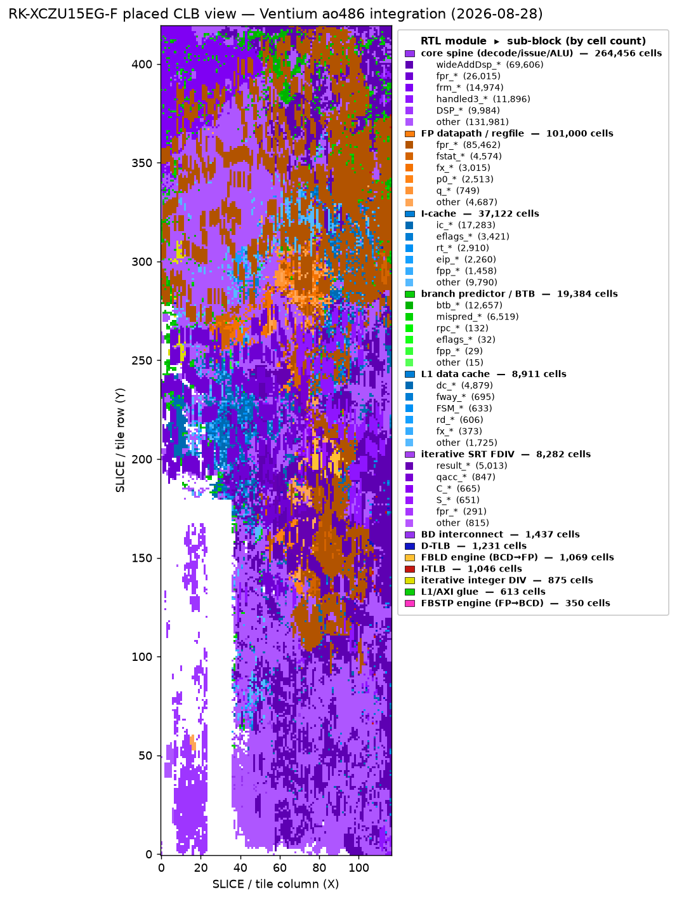

# Ventium

<p align="center">
  
</p>

[][docs]

[docs]: https://al-255.github.io/ventium/

<p>
  
</p>

Ventium is a synthesizable SystemVerilog reconstruction of the original Intel
**Pentium P5/P54C (non-MMX)**.  It has a five-stage, in-order U/V integer
pipeline, a pipelined x87 unit, split L1 caches/TLBs, two-level paging, and
substantial system-mode support.  Verilator simulations produce per-retirement
architectural traces and compare them with a pinned QEMU Pentium oracle.

This README describes the current **`ao486-mister-sim`** branch.  The hosted
Sphinx site primarily follows `main` and is useful background, but can describe
a different checkout.  Consult the files and commands below before relying on
any older status report or web page.

## Status and scope

The differential gate is the functional authority.  A source change is not
accepted merely because it improves a cycle match, produces a bitstream, or
reaches farther in a guest.

- **Core:** the supported instruction/system-mode subset includes dual issue,
  x87 (including the P5 FDIV erratum model), protected mode, paging, exceptions
  and interrupts, task-switch/SMM/debug paths, and virtual-8086 mode.  The
  precise unsupported or deliberately scoped behavior is in
  [`docs/unsupported-isa.md`](docs/unsupported-isa.md).
- **Current PC platform:** Ventium replaces the CPU in the ao486 MiSTer system
  through [`ao486-sim/ven/ven_ao486_shim.sv`](ao486-sim/ven/ven_ao486_shim.sv).
  The rest of the PC platform is retained; the integration design is in
  [`ao486-sim/VENTIUM_SWAP.md`](ao486-sim/VENTIUM_SWAP.md).
- **L2/northbridge:** deliberately disabled in this branch.  `EN_L2=1` is not
  a supported build, and no result here establishes L2 coherence, maintenance,
  or system-wide LOCK atomicity.
- **Board acceptance:** experimental and still open.  A boot progress trace,
  a debug capture, modified guest media, or a save-state/replay is diagnostic
  evidence only.  The acceptance ladder requires ordinary media and real
  SeaBIOS → disk → FreeDOS → Quake → Windows 95 execution.

The private [`ventium-refs/`](ventium-refs/) submodule supplies the Intel
reference material, the pinned QEMU 8.2.2 build, and selected test programs.
It must be initialized for most differential gates; a distribution QEMU is not
an equivalent substitute.

## Architecture

```
                      architectural traces
  test image ──► Ventium RTL ─────────────────► compare.py ──► QEMU golden
                  │
                  ├─ U/V integer pipeline + branch prediction
                  ├─ x87 state/datapath + iterative divide/transcendentals
                  ├─ split I/D L1s, TLBs, paging, fragment engine
                  └─ ao486 shim: AXI-to-Avalon, I/O, interrupt, and A20 adapters
                                      │
                              ao486 MiSTer PC peripherals / DDR model
```

The core's memory interface follows important contracts that tests depend on:

- translatable requests use one canonical linear-address generator;
- the fragment engine owns cross-page splitting, probes, aborts, and response
  merging — producers may not bypass it;
- non-cacheable reads are byte-exact aligned AXI pieces, not silently widened
  line accesses; and
- flushing, translation, cacheability, and physical executable coherence are
  configuration-sensitive and must be tested in the profile being changed.

See [`docs/rtl-interface.md`](docs/rtl-interface.md) and
[`docs/trace-format.md`](docs/trace-format.md) before changing interfaces or
trace production.

## Repository layout

```
rtl/                Synthesizable core, x87, cache/TLB, AXI, and P5 bus RTL
  core/             Pipeline spine, decoder, U/V issue, branch prediction
  fpu/              x87 state and iterative arithmetic engines
  mem/              L1s, TLBs, fragment/AXI support, CDC helpers
  bus/              Pin-level P5 bus model
verif/              QEMU differentials, system tests, L1/bus/unit gates
ao486-sim/          Full-PC Verilator harness and Ventium ao486-core swap
fpga/               RK board host tools, Vivado helpers, and debug utilities
docs/               RTL/specification/trace documentation and Sphinx sources
tools/              Trace, opcode, arithmetic, and utilization helpers
3rd-party/          MiSTer and OPL3 submodules
ventium-refs/       Private manuals, QEMU oracle, and test payloads
```

There is no `rtl/soc/` directory in this branch.  The historical standalone
SoC, M7 workload harness, and older `verif/soc` gate references are not part of
the checked-out supported flow.

## Quick start and verification

```bash
git submodule update --init --recursive

# Fast required gate: functional differential tests plus M4/M5 cycle bands.
make verify

# System-mode corpus and focused system regressions.
make verify-sys

# Cache/memory, P5-bus, structural lint, and status-documentation checks.
make l1
make bus bus-sva
make lint
make docs-status

# Aggregate gate.  PASS gates and any explicitly pinned expected failures are
# reported separately; a pin is never a correctness pass.
make verify-all
```

`make verify` is required after every RTL change.  Run the focused gate for the
changed contract as well: for example, fragment changes require `pxfrag`/
`fxabort`; flush changes require `prsmflush`; AXI-width changes require the
narrow-read gate; and changes to a supported configuration require its lint
profile.  Use the pinned filelists (`rtl/ventium.f`, `rtl_ven_core.f`, and
`rtl_ven_soc.f`); do not glob `rtl/**`, because package order is significant.

### Full-PC Verilator simulation

```bash
ao486-sim/setup.sh
make -C ao486-sim          # baseline ao486 platform
make -C ao486-sim ven      # Ventium-swapped platform
```

The full-PC model is an integration/debug environment, not a replacement for
the core differential gate.  Its current bring-up history is intentionally
kept separate in [`ao486-sim/DISK_BOOT_STATUS.md`](ao486-sim/DISK_BOOT_STATUS.md).

## FPGA: RK-XCZU15EG-F

The current hardware target is the RK-XCZU15EG-F board, not the historical
KV260 flow described in older synthesis material.  The complete operating
procedure — source boundaries, single-Vivado rule, preflight, build, deploy,
debug register map, and acceptance ladder — is
[`HOW_TO_RUN_FPGA.md`](HOW_TO_RUN_FPGA.md).

The board integration has three source boundaries:

| Location | Responsibility |
| --- | --- |
| This repository | Ventium RTL, ao486 shim, simulation gates, host debug tools |
| External `ao486_MiSTer/fpga/rk-ao486-system` flow | Board top, PS/PL bridges, Vivado project, daemon/deployment helpers |
| `RK-XCZU15EG-F-Template` | Board preset, Linux/FPGA-manager reference, BSP/SD-image flow |

Builds must use `fpga/run_vivado_exclusive.sh`; it prevents orphaned Vivado
jobs from consuming memory or racing a new implementation run.  Run a clean
source-matched implementation and review final timing, DRC, clock, and
utilization reports before programming the board.  A generated `fpga_run_*`
directory is disposable except for a deliberately retained deployable artifact
or capture needed by the next debug session.

### Latest retained placed CLB visualization

This graphical device view was regenerated from the retained 2026-08-28 Vivado
2025.2 placed checkpoint for `rk_ao486_bd_wrapper` on
`xczu15eg-ffvb1156-2-i`.  Each plotted tile is a placed primitive site; color
identifies the recognized RTL module and luminance separates its major leaf
groups.  White regions are not populated by the plotted CLB primitives.  This
is a capacity/routability view, not timing, DRC, or guest-correctness sign-off.



| Resource | Used / available | Utilization |
| --- | ---: | ---: |
| CLB LUTs | 317,438 / 341,280 | 93.01% |
| CLB sites | 41,650 / 42,660 | 97.63% |
| Registers | 42,743 / 682,560 | 6.26% |
| Block RAM tiles | 85 / 744 | 11.42% |
| DSP48E2 | 1,264 / 3,528 | 35.83% |

The CLB-site figure leaves little placement headroom.  Treat logic compaction
as a correctness-sensitive engineering task: preserve single-owner FSM state,
one-burst cache fills, exact request widths, and explicit shared-arithmetic
handshakes.  Do not trade congestion for global flushing, duplicate line fills,
unbounded replay, guest-specific RTL, or a serialized common path.

Regenerate the graphical view from a new placed checkpoint with the historical
device-view flow.  The Vivado step is read-only against the checkpoint and must
use the single-run guard:

```bash
DCP=<impl>/rk_ao486_bd_wrapper_placed.dcp \
OUT=/tmp/ventium-cells.csv \
  fpga/run_vivado_exclusive.sh -mode batch \
  -source fpga/scripts/dump_cells_loc_soc.tcl

MPLCONFIGDIR=/tmp/ventium-matplotlib \
  python3 fpga/scripts/render_device_view.py \
    /tmp/ventium-cells.csv \
    docs/fpga-clb-placement-rk-xczu15eg.png \
    "RK-XCZU15EG-F placed CLB view — Ventium ao486 integration"
```

[`docs/fpga-synthesis.md`](docs/fpga-synthesis.md) remains an explicitly
historical KV260/OOC study; use it for background only, not current board
commands or current resource claims.

## Debugging and acceptance rules

The custom board debug block can capture retirement state, trace rings,
breakpoints, freeze context, and selected memory/transaction observations.  It
is not full JTAG: the deployed image does not contain a Xilinx debug hub/ILA/VIO
scan chain.  The current capabilities and safe use are documented in
[`HOW_TO_RUN_FPGA.md`](HOW_TO_RUN_FPGA.md).

When debugging a board failure:

1. Preserve source revision, defines, bitstream hash, clock profile, disk-image
   hash, and daemon/debug-tool version.
2. Use the least invasive capture that distinguishes the next hypothesis.
3. Reproduce any RTL repair in the differential and focused simulation gates.
4. Repeat the board ladder on unmodified media.  A patched Quake/CWSDPMI image,
   injected marker, or restored save-state may diagnose a point in execution,
   but cannot prove a general processor.

## Contributing

- Keep one module per file and package/filelist ordering intact.
- Do not hand-format `.vtrace` files; emit through `verif/diff/tracefmt.py`.
- Never make a green gate by weakening comparison masks, downgrading a failure
  to a pin, or silently widening/serializing a request.
- Update `tools/opcode_map/coverage_data.json` and regenerate the opcode map when decoder arms
  change.
- Keep generated Vivado products, disk images, object trees, and local review
  notes out of commits.  Commit source, tests, concise run provenance, and
  reproducible scripts instead.

Keep current engineering state, open boundaries, and the required acceptance
ladder in checked-in tests and procedures.  Local review notes are deliberately
excluded from the repository and must not become a second source of truth.
