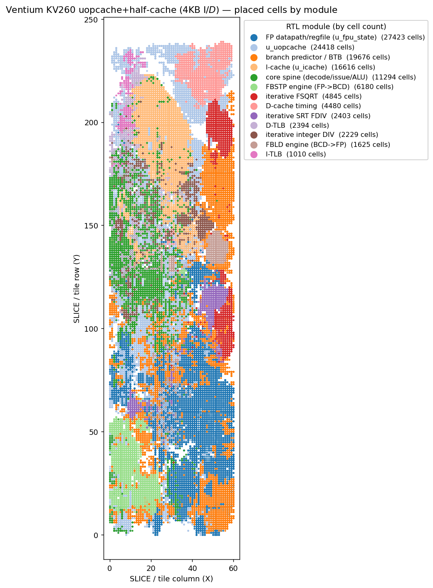

# FPGA synthesis & APR (KV260 / ZU15EG)

Real Vivado out-of-context synth → place → route results for the Ventium `core`,
with device views, the congestion analysis, and the config matrix. Summarized in
the [README](../README.md#fpga-synthesis-kv260); full detail here.

The core + FPU are fully synthesizable. Below is the **real Vivado placement** of
the `core` (out-of-context) on the KV260's **XCK26** (Zynq UltraScale+ ZU5EV,
`xck26-sfvc784-2LV-c`), every placed leaf cell colored by its RTL module — the
physical clusters (I-cache + the folded byte-window decode spine, FP datapath,
branch predictor, the iterative FP engines, the core spine, …):

The byte-window decode muxes (`u_icache`, the `-flatten_hierarchy rebuilt` instance
that absorbs the spine's 12×32:1 alignment fabric) are the **level-5 routing-congestion
hotspot** — the bright band in the placement-density map (peak ≈ 340 cells / 4×4-tile bin):

**Best numbers** — OOC `core`, `+VTM_NO_DPI`, 15 ns target. Two configs: the
**verified production** config (narrowb, **bit-exact vs QEMU 75/75 + cycle bands**)
and the **experimental predecoded µop-cache** (`+VEN_UOPCACHE`, synth/APR-valid;
not yet verify-hardened) which deletes the byte-window decoder for a slot read:

| Resource | narrowb (production) | `+VEN_UOPCACHE` | Available |
|---|---:|---:|---:|
| **CLB LUTs (synth)** | 93,883 (80.2 %) | **79,442 (67.8 %)** | 117,120 |
| MUXF7 / MUXF8 | 14,311 / 6,216 | **11,101 / 4,181** | 58,560 / 29,280 |
| CARRY8 | 2,119 | 1,861 | 14,640 |
| DSP48E2 | 31 | 31 | 1,248 |
| Block RAM | 0 | 40 | 144 |
| **Fmax — logic only** | ~147 MHz (6.8 ns FP cone) | ~145 MHz | — |
| **Fmax — placed** (WNS@15 ns) | 46.0 MHz | 52.4 MHz | — |
| **Full route @ 15 ns** | ✗ does **not** route (42,392 overlaps) | ✅ **0 failed nets** | — |
| **Fmax — routed** (real OOC) | — (congestion wall) | **51.7 MHz** | — |

**The headline APR result:** at a 15 ns target the **predecoded µop-cache routes cleanly to a
real 51.7 MHz** (0 failed nets, routed WNS −4.35 ns) — while the production byte-window config
**cannot route at all** (the router gives up with 42,392 congestion overlaps). The µop-cache is
the **first config to route the design legally at a tight clock**, vs the prior ~35–42 MHz
*estimate*. Caveat: `+VEN_UOPCACHE` is an Fmax/APR demonstrator — it is **synth/route-valid and
its FP/area changes are bit-exact, but the slot-read front-end is not yet functionally
verify-hardened** (the `uop_ready` stall + branch-into-middle re-predecode are unbuilt); the
**narrowb config is the verified-bit-exact 75/75 production build**.

- **Area — the FP datapath shrink ([`TIMING_PROBLEMS.md`](../fpga/TIMING_PROBLEMS.md) P0-13):
  −9,635 LUT (−10.7 %), bit-exact.** `fx_to_int_ex` (the FP→int conversion under FIST +
  FBSTP) carried a 128-bit barrel shifter where only 64 bits are ever non-zero — narrowing
  it bit-exactly (verified `make verify` 75/75) halved it across all five FIST/FBSTP
  instances (−8,636), plus a shared-round `f_eval` split (−999). The mantissa multiply was
  already in DSP (16 of 31 DSP48s), so it was never the LUT cost. Earlier wins: iterative
  FDIV/FSQRT/integer-DIV/FBSTP/FBLD engines + LUTRAM/BRAM caches brought the as-is 518 %
  single-cycle datapath under the device.
- **The predecoded µop-cache (P0-11) is the first lever to *reduce* the byte-window MUXF**
  (−22 % F7 / −33 % F8) instead of relocating it — by running the decoder on the multi-cycle
  fill walk and reading fixed-width µops by slot (the textbook P6/Sandy-Bridge fix; the user's
  "predecode prefixes 1 byte/cycle, pipeline the SIB length" insight). The *placer's* congestion
  level still reads level-5 (its density estimate is diffuse across the coupled front-end —
  BTB 23 %, icache 18 %, slow-path decoder 13 %, …), but that metric is misleading: the **actual
  router converges (0 overlaps) for the µop-cache and not for narrowb (42,392)** — the lower MUXF
  gives the router the channels it lacked. The route is the judge ([P0-14](../fpga/TIMING_PROBLEMS.md)).
- **Fmax: the design is routing-congestion-bound, not logic-bound.** The worst path is the FP
  deferred-commit cone `fpp_reg → fpr` at ~6.8 ns *logic* (≈147 MHz) but **65 % routing** — the
  byte-window/front-end MUXF cluster has no spare channels. Placed: **46.0 MHz (narrowb) /
  52.4 MHz (µop-cache)**. A full Vivado strategy sweep (P0-9: `-muxf_remap`, AltSpreadLogic,
  AlternateRoutability, the congestion strategies) closes **none** of it — an architectural
  property of the single-cycle x86 byte-window decode, not a tooling choice.
- **The honest path to 66 MHz** (P0-12): the OOC placer has no PS8 anchor / floorplan, so it
  smears the whole `eip`-coupled front-end into one clock region. The cure for *diffuse-coupled*
  congestion is **in-context place + floorplan** (spread the cluster across regions near the
  PS8) — the real-chip number we must measure to ship — or a lower-utilization / higher-grade
  device. A **2-stage FP execute pipeline** (`+VEN_FP_PIPE`) and a **BTB-update pipeline**
  (`+VEN_BTB_PIPE`) keep FP + branch-predict off the critical path with **both FP and
  branch-mispredict cycle bands bit-identical**.

### On a larger device (ZU15EG): the verified production config routes

The **same verified `narrowb` production RTL**, OOC on a **Zynq UltraScale+ ZU15EG**
(`xczu15eg-ffvb1156-2LV-e`, same `-2LV` speed grade as the KV260, but ~3× the fabric:
341,280 LUTs), placed by module:

**The headline:** at the *same* 15 ns target, the production `narrowb` config — which is
**bit-exact-verified but cannot route on the KV260** (42,392 congestion overlaps, router
gives up) — **routes cleanly on the ZU15EG** (router converges: **0 overlaps, 0 unrouted
nets**). The 3× routing fabric gives the byte-window front-end the escape channels it lacks
on the small part. This is the first clean route of the *verified* build at a tight clock.

| Resource | KV260 `narrowb` (XCK26 / ZU5EV) | **ZU15EG `narrowb`** (`xczu15eg-…-2LV`) |
|---|---:|---:|
| CLB LUTs | 93,883 (**80.2 %** of 117,120) | 93,961 (**27.5 %** of 341,280) |
| CLB Registers | 28,675 | 29,394 (4.3 %) |
| MUXF7 / MUXF8 | 14,311 / 6,216 | 14,312 / 6,216 |
| CARRY8 / DSP48E2 / BRAM | 2,119 / 31 / 0 | 2,119 / 31 / 0 |
| Placer congestion | level 6 (wall) | level 5 (local, `u_icache` byte-window) |
| **Full route @ 15 ns** | ✗ **does not route** (42,392 overlaps) | ✅ **routes — 0 overlaps / 0 unrouted** |
| Fmax — placed (WNS@15 ns) | 46.0 MHz | 51.1 MHz (WNS −4.56 ns) |
| **Fmax — routed (real OOC)** | — (never routed) | **40.6 MHz** (WNS −9.60 ns) |

The routed **40.6 MHz** is the honest critical-path number — lower than the placer's 51 MHz
*estimate* because actually wiring the congested byte-window region costs real routing delay,
and lower than the ~148 MHz logic-only ceiling (the FP cone is **6.74 ns**). The placer still
flags **level-5 congestion local to `u_icache`** even on the big device — confirming the wall
is the **single-cycle x86 byte-window decode itself**, an architectural property, not a device
or tooling limit. The bigger part buys *routability* (and a clean, shippable bitstream path),
not a dramatically higher clock; closing toward 66 MHz still needs the µop-cache front-end
([P0-11](../fpga/TIMING_PROBLEMS.md)) and in-context floorplanning ([P0-12](../fpga/TIMING_PROBLEMS.md)).

Reproduce — KV260: `CONFIG=narrowb MODE=full vivado -mode batch -source fpga/scripts/apr_run.tcl`;
ZU15EG: prepend `PART=xczu15eg-ffvb1156-2LV-e OUTTAG=_zu15eg`. Then
`python3 fpga/scripts/render_device_view.py …` / `render_congestion.py` / `render_compare.py`.
Full timing backlog + methodology in [`fpga/TIMING_PROBLEMS.md`](../fpga/TIMING_PROBLEMS.md).

### Half-cache variant (`+VEN_CACHE_HALF`): congestion relief ≠ higher Fmax

A clean experiment to test whether the `u_icache` congestion is the Fmax wall: halve
both L1s to **4 KB** (64 sets / 21-bit tag instead of 128 / 20), gated behind
`+VEN_CACHE_HALF` so the default build stays byte/cycle-identical (`addr[5 +: 7]` is
literally `addr[11:5]`). The cache is a hit/miss + data store, so smaller just means
more fills, same bytes — **functionally bit-exact**: both the default *and* the
`+VEN_CACHE_HALF` builds pass `make verify` **77/77** vs QEMU (the 64-set geometry is
confirmed in the elaborated netlist). It is **not** a cycle-fidelity config — the
fixed-128-set cycle oracle no longer matches the miss sequence — so the M4/M5 bands are
only claimed for the default build. Run on the **µop-cache** base (`+VEN_UOPCACHE`, the
config that routes), same KV260 part / 15 ns target:

| Metric (routed OOC, KV260, 15 ns) | µop-cache **full** (8 KB) | µop-cache **half** (4 KB) | Δ |
|---|---:|---:|---:|
| `u_icache` placed cells | 30,413 | 16,616 | **−45 %** |
| F7 / F8 muxes | 11,101 / 4,181 | 7,906 / 3,192 | **−29 % / −24 %** |
| CLB LUTs | 79,722 | 77,547 | −2.7 % |
| BRAM tiles | 40 | 40 | 0 |
| Placer congestion | **level 6** (`u_icache` 86–96 %) | **level 5** (`u_icache` 87 %, now sharing with FP/BTB) | ↓ one level |
| Failing endpoints / TNS | 21,095 / −51,509 ns | **16,221 / −32,019 ns** | **−23 % / −38 %** |
| **Fmax — routed** | **51.7 MHz** (WNS −4.35 ns) | **50.1 MHz** (WNS −4.94 ns) | ≈ flat |

**The finding is the point:** halving the cache does exactly what it should to *congestion*
— `u_icache` cells −45 %, the F7/F8 read-mux trees −25–29 %, placer level 6 → 5, and the
**bulk** of timing improves sharply (failing endpoints −23 %, TNS −38 %). But routed
**Fmax barely moves** (51.7 → 50.1 MHz, within placement noise), because the **worst path is
not the cache** — it is the FP deferred-commit cone `fpp_b_reg[66] → u_fpu_state/fpr_reg`,
which the smaller cache doesn't touch. So the icache congestion gates *routability and the
endpoint tail*, while the *single critical path* is FP-datapath-bound. Closing toward 66 MHz
needs the FP cone pipelined, not less cache — and shrinking the cache is a real area/tail win
that's free to keep (functionally verified), just not the Fmax lever. Reproduce:
`HALF=1 CONFIG=uopcache MODE=full OUTTAG=_half vivado -mode batch -source fpga/scripts/apr_run.tcl`.

