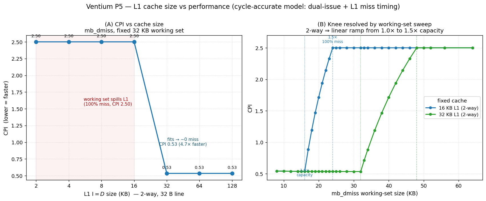

==================================================
L1 cache size vs performance — the miss-rate knee
==================================================

How much does L1 cache size matter for Ventium's performance, and *where* does
it stop mattering? This page measures it directly in the **cycle-accurate
model** — the same ``cycle_mode`` the M4/M5 gates use, where the dual-issue U/V
pipeline and the L1 miss-timing state machine are live — and shows that the
answer has a sharp, well-understood structure: a **knee** governed by the ratio
of the working set to the cache capacity, whose shape is the direct fingerprint
of the cache's **two-way associativity**.

   **(A)** CPI of the ``mb_dmiss`` cache-stress kernel as the L1 size is swept
   2–128 KB (fixed 32 KB working set). **(B)** The same knee resolved at fine
   resolution by instead sweeping the *working set* against fixed 16 KB and
   32 KB caches — revealing that the transition is a linear ramp from 1.0× to
   1.5× of capacity, and that it scales exactly with cache size.

What is measured, and on what
=============================

The L1 **timing** model (a read-allocate, two-way-LRU hit/miss state machine
with an 8-clock miss penalty, matching the ``p5trace.so`` oracle's
``l1_access()``) is only active in ``cycle_mode`` — i.e. under the testbench's
``--cycle`` flag, which also enables dual-issue. In plain functional mode the
caches still serve data but their *timing* is not charged, so cache size has no
effect on the clock count. Every number here therefore comes from a ``--cycle``
run, and the metric is **CPI = core clocks ÷ retired instructions**, read from
the testbench's end-of-run ``retired N instructions in M clocks`` line.

The workload is **``mb_dmiss``**, the directed D-cache-stress kernel from the
M5 suite. It strides a load by exactly one 32-byte line through a buffer far
larger than the cache, so — once the working set no longer fits — *every* load
touches a freshly-evicted line and misses, adding the full 8-clock penalty.
Because cache size changes only *timing*, never the retired-instruction stream,
a fixed instruction budget makes the CPI of different geometries directly
comparable.

.. note::

   **Why not Dhrystone?** Two reasons. First, Dhrystone's working set is a few
   KB — it fits in even the smallest L1 here, so it would sit on the fast
   plateau across the whole sweep and show no knee at all; ``mb_dmiss`` is
   purpose-built to *expose* the cache-size dependence. Second, and more
   fundamentally, Dhrystone cannot currently run in ``cycle_mode``: the
   dual-issue path mishandles the ``set_thread_area`` / ``%gs`` TLS setup and
   diverges at the first ``ret`` after libc init. (It runs bit-exactly in
   functional mode — that path is verified against QEMU — but functional mode
   does not model cache timing.) ``cycle_mode`` is validated against the
   ``p5trace.so`` oracle only on the flat, syscall-free ``mb_*`` micro-kernels,
   which is exactly the class ``mb_dmiss`` belongs to.

Panel A — the cache-size knee
=============================

Sweeping the unified L1 size (I$ = D$) from 2 KB to 128 KB against ``mb_dmiss``'s
32 KB working set:

.. list-table::
   :header-rows: 1
   :widths: 18 14 16 18 34

   * - L1 size
     - sets (2-way)
     - CPI
     - rel. perf
     - D-cache behaviour
   * - 2 KB
     - 32
     - 2.50
     - 1.00×
     - 100 % miss
   * - 4 KB
     - 64
     - 2.50
     - 1.00×
     - 100 % miss
   * - 8 KB
     - 128
     - 2.50
     - 1.00×
     - 100 % miss (production geometry)
   * - 16 KB
     - 256
     - 2.50
     - 1.00×
     - 100 % miss
   * - **32 KB**
     - **512**
     - **0.53**
     - **4.68×**
     - **working set fits**
   * - 64 KB
     - 1024
     - 0.53
     - 4.68×
     - fits
   * - 128 KB
     - 2048
     - 0.53
     - 4.68×
     - fits

The knee lands **exactly at 32 KB** — where the 1024-line working set first fits
the 512-set × 2-way cache. Below it, every load misses and the 8-clock penalty
dominates (CPI 2.50). At and above it, misses vanish and the dual-issue pipeline
pairs the loop body two instructions per clock, giving a **sub-1.0 CPI of 0.53 —
a 4.7× speedup**. Past the knee, more cache buys nothing: the working set
already fits.

The 8 KB point (the production geometry) reproduces the M5 golden CPI of 2.50,
which is a useful cross-check that the parametrically-sized configurations match
the shipping cache exactly.

Panel B — resolving the knee (and the 2-way fingerprint)
========================================================

The cache size is **quantized**: with a fixed 2-way / 32-byte-line geometry the
set count must be a power of two (the index is a clean bit-slice,
``addr[5 +: $clog2(SETS)]``), so the only buildable D-caches are 16 KB, 32 KB,
64 KB… There is no 20 KB or 24 KB cache to build without changing
*associativity*, which would mean rewriting the LRU/victim logic. But the knee
is governed by **working set ÷ capacity**, so it can be resolved at arbitrary
resolution by the dual experiment: hold the cache fixed and sweep the *working
set* (just recompiled ``mb_dmiss`` variants — no RTL rebuild).

Doing so at a fixed 16 KB cache exposes the internal structure the coarse sweep
hid:

.. list-table::
   :header-rows: 1
   :widths: 22 16 14 48

   * - Working set
     - ratio
     - CPI
     - what is happening
   * - ≤ 16 KB
     - ≤ 1.0×
     - 0.54
     - fits in two ways → ~0 misses
   * - 17 KB
     - 1.06×
     - 0.88
     - first sets see a 3rd competing line → thrash begins
   * - 18 KB
     - 1.13×
     - 1.19
     -
   * - 20 KB
     - 1.25×
     - 1.72
     -
   * - 22 KB
     - 1.38×
     - 2.14
     -
   * - **24 KB**
     - **1.5×**
     - **2.50**
     - every set sees ≥ 3 lines → 100 % miss (saturated)

The transition is a **clean linear ramp from 1.0× to 1.5× capacity**, and that
slope *is* the two-way-associativity fingerprint. A sequential line-stride
starts thrashing the instant a set sees a third competing line (just past 1.0×),
and thrashes *completely* once every set does — which for this access pattern
happens at exactly **1.5×** capacity, not 2×. A direct-mapped cache would knee
almost instantly; a fully-associative cache would stay flat until exactly 1.0×
and then cliff. The 1.0×→1.5× ramp is specifically what two-way gives.

The knee also **scales exactly with cache size**: the 32 KB curve is the 16 KB
curve stretched 2× (flat to 32 KB, ramp 32→48 KB, flat after), and the two
curves coincide at equal *ratios* — e.g. a 1.125× working set gives CPI 1.19 on
both — confirming that performance in this regime depends only on
working-set/capacity, not on absolute size.

Methodology and reproduction
============================

Cache geometry is selected by the ``IC_SETS`` / ``DC_SETS`` localparams in
``rtl/core/core.sv`` (default 128 sets = 8 KB; ``+VEN_CACHE_HALF`` = 64 sets =
4 KB), which parameterise the ``icache`` and ``dcache_timing`` modules
(``logic [TAGW-1:0] tag [SETS][2]`` etc., so the arrays scale automatically).
For the sweep each size was built into its own ``obj_dir`` with an extra
``+define`` overriding the set count, then ``mb_dmiss`` (and a many-sweep
variant, so the one mandatory cold sweep amortises to a clean steady state) was
run under ``--cycle``. The host-compiler optimisation level does not affect the
cycle counts — only Verilator's simulation speed — so it is irrelevant to the
result.

This is a *performance* characterisation, not a verification gate: all
geometries remain functionally bit-exact (a smaller cache only does more fills
of the same bytes). The shipping 8 KB / 2-way / 32 B geometry is the one
validated cycle-accurately against the ``p5trace.so`` oracle; see the M5 cache
bands and :doc:`srt-divider` for the broader cycle-model methodology, and
:doc:`../reference-library` for the timing-model sources.
