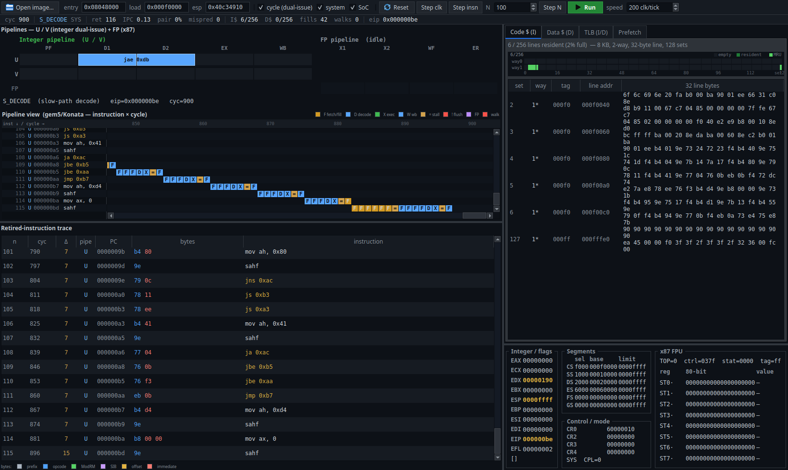

<!--
Copyright 2026 Anhang Li (AL-255, thelithcore@gmail.com)
SPDX-License-Identifier: Apache-2.0 WITH SHL-2.1
-->
# Ventium pipeline visualizer

An interactive PySide6 GUI that runs the **real verilated Ventium RTL** as its
backend and visualizes, cycle by cycle, what the core is doing: the three
pipelines (U / V integer dual-issue + the x87 FP pipe), what's resident in the
TLB / code cache / data cache / prefetch buffer, and the retired-instruction
trace with raw bytes and disassembly.

It does **not** modify `rtl/` or the verification build — it verilates a private
copy of `ventium_top` with `--public-flat-rw` so the C++ bridge can read every
internal core/cache/TLB/FPU signal directly out of the model (a cross-module
reference into the live RTL state), and drives the exact `clk`/reset/`mem_*`
loop the production testbench (`verif/tb/tb_main.cpp`) uses.



## Quick start

```sh
# build the backend (verilate + link libventium_viz.so) and launch the GUI
tools/pipeviz/run.sh

# user-mode examples
tools/pipeviz/run.sh build/m2/mb_brloop.flat         # dual-issue loop
tools/pipeviz/run.sh build/m2/mb_dmiss.flat          # D-cache thrash (fills the D$)
tools/pipeviz/run.sh build/m2/mb_imiss.flat          # I-cache misses (fills the I$)
tools/pipeviz/run.sh build/m2/mb_fpindep.flat        # x87 FP pipe
tools/pipeviz/run.sh build/m2/mb_brrandom.flat       # random-branch mispredicts

# system / paging examples (slow-path waterfall + TLB + page walks)
tools/pipeviz/run.sh verif/sys/tests/ppage/ppage.bin
tools/pipeviz/run.sh verif/sys/tests/ptask/ptask.bin

# full-SoC bare-metal test (needs the SoC port-I/O): the test386.asm CPU test.
# build the SoC model once, then load it (auto-detected as a SoC image):
tools/pipeviz/build.sh --soc
tools/pipeviz/run.sh ventium-refs/09-external-cpu-tests/test386.asm/test386.bin

# force a rebuild of the backend (add --soc to also build the SoC model)
tools/pipeviz/run.sh --build
```

Requirements (all already present in this repo's toolchain): `verilator` (5.x),
a C++17 compiler, `python3` with **PySide6** and **capstone**
(`pip install PySide6 capstone`).

## What you see

* **Pipelines panel** (main, top-left)
  * *Stage board* — the classic P5 in-order stages **PF → D1 → D2 → EX → WB**
    (plus the FP **X1 / X2 / WF / ER** stages) as **U / V / FP** lanes. The
    cell(s) the core is working in this clock are lit and labelled with the
    occupying instruction. Derived live from the FSM `state` in
    `rtl/core/core.sv`.
  * *Pipeline view* — a **gem5/Konata-style** per-instruction timing diagram:
    **Y axis = instructions** (one row each, retire order), **X axis = cycles**
    (time →). Each instruction's lifecycle is reconstructed from the per-cycle
    FSM trace and drawn as a run of coloured stage cells — **F** fetch/fill,
    **D** decode, **X** execute, **M** mem, **W** writeback, **=** stall,
    **!** mispredict-flush — so consecutive instructions cascade diagonally
    (the classic superscalar pipeline diagram). Integer execute is green,
    x87 FP execute purple; a stalled instruction's stage stretches (e.g. a
    D-cache miss shows as a long amber `= = =` run before its `X`). A frozen
    left gutter holds the instruction labels (n / U·V pipe / PC / mnemonic) and
    a synced top axis shows cycle ticks. Hover a row for its cycle span.
* **Memory tables** (top-right) — tabs for the **Code cache** (resident I-cache
  lines + their 32 bytes), **Data cache** (resident D-cache lines; timing model,
  no data array), **TLB** (valid split I/D entries — only populated under paging),
  and the **Prefetch buffer** (`ibuf[16]` + the fast-path fetch window, live
  decode). The I$/D$ tabs show a **256-cell occupancy heatmap** (one cell per
  set×way) above the table for an instant picture of how full the cache is.
* **Trace panel** (bottom-left) — one row per retired instruction: `n`, retire
  cycle, issuing pipe (U/V), PC, raw **bytes**, and the capstone disassembly.
  The bytes are coloured by x86 field: **light-gray prefix, blue opcode, green
  ModRM, purple SIB, yellow displacement, red immediate**. The disassembly is
  16- or 32-bit per instruction (driven by the live CS.D), so real-mode and
  protected-mode code both decode correctly.
* **Status bar** — live `IPC`, dual-issue `pair%`, `mispred` count, I$/D$
  occupancy, I-cache `fills`, page-table `walks`, and the current FSM state/mode.
* **Registers panel** (bottom-right) — GPRs, decoded EFLAGS, segments, control
  registers, and the x87 stack (logical ST(0..7) with decoded `floatx80` values).

## Controls

| control | action |
|---|---|
| **Open image…** | load a flat binary (honours a sibling `manifest.json` for `entry`/`load_addr`) |
| entry / load / esp | reset-time architectural state (hex) |
| **cycle (dual-issue)** | enable the U/V fast path — **on by default** (the V pipe only issues in cycle mode) |
| **system** | cold-boot in system mode (real-mode reset at `F000:FFF0`; needed for paging/TLB) |
| **SoC** | run the full `ventium_soc` (internal port-I/O / PIC / PIT) — needed for bare-metal images like test386. Requires `build.sh --soc`; auto-ticked for test386. |
| **Reset** | re-cold-reset on a fresh model (clears memory) |
| **Step clk** (`.`) | advance one core clock |
| **Step insn** (`Space`) | advance until the next retirement |
| **Step N** | advance N clocks |
| **Run / Pause** (`F5`) | free-run at *speed* clocks per refresh tick |

## Architecture

```
 PySide6 GUI (pipeviz/*.py)
   │  ctypes
   ▼
 libventium_viz.so  ── C ABI (ventium_viz.h)
   │  wraps + drives
   ▼
 Vventium_top  ── verilated --public-flat-rw  (rtl/ventium.f, unmodified)
   └── internal state read via the generated ___024root struct
       (u_core.state / ibuf / u_d,v_d / gpr / u_icache / u_dcache_tm /
        u_itlb / u_dtlb / u_fpu_state / …)
```

* `ventium_viz.cpp` — the bridge: instantiates the model, reuses the production
  BFM memory (`verif/tb/memmodel.cpp`), implements the `vtm_retire*` DPI
  callbacks to capture each retirement into a ring buffer, samples per-clock
  microarch state into a timeline ring, and exposes everything over a flat C ABI.
* `pipeviz/backend.py` — ctypes mirror of the C ABI (with a `sizeof` self-check).
* `pipeviz/disasm.py` — capstone disassembly + the FSM-state → pipeline-stage map.

## Notes on fidelity

* The Ventium core is FSM-driven, not a textbook latch-per-stage superscalar, so
  the stage board maps each FSM `state` to the P5 stage it corresponds to rather
  than inventing per-stage instruction latches. The timeline shows the genuine
  emergent cadence (issue, stalls, fills, FP occupancy).
* The **U/V dual issue** only activates in **cycle mode** (default on); in func
  mode the core is single-issue. **FP** ops appear on the FP lane.
* The **TLB** only fills when paging is active — load a system/paging image and
  tick **system** to see I/D TLB entries. In flat user mode it stays empty (no
  translation), which is correct.
* The D-cache is a timing-only model in the RTL (tag/valid/LRU, no data array),
  so its table shows residency, not bytes.

## Files

| file | role |
|---|---|
| `build.sh` | verilate `--public-flat-rw` + link `libventium_viz.so` |
| `run.sh` | build-if-needed + launch the GUI |
| `ventium_viz.h` / `.cpp` | the C ABI + Verilator backend bridge |
| `pipeviz/` | the PySide6 application |
| `smoke_test.c` | minimal C end-to-end check of the C ABI |
| `verify_gui.py` | offscreen GUI smoke + screenshot |
